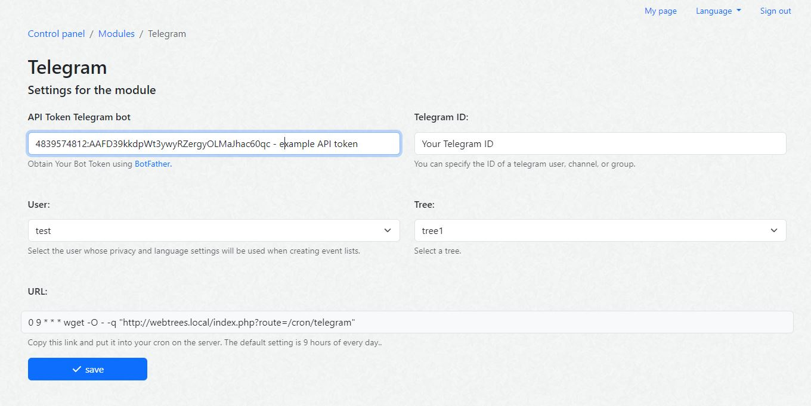
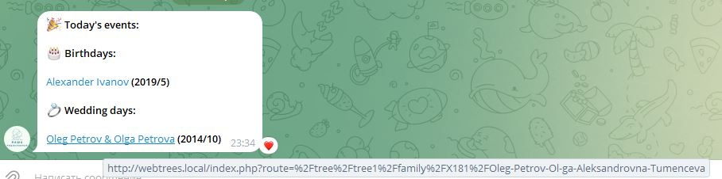

# Webtrees Module: Telegram Notifications

[](http://www.gnu.org/licenses/gpl-3.0)


This [webtrees](https://www.webtrees.net/) custom module sends Telegram notifications about significant family events, such as birthdays and anniversaries, based on the data from your webtrees installation.

## Contents
This Readme contains the following main sections:

* [Warning](#warning)
* [Description](#description)
* [Screenshots](#screenshots)
* [Requirements](#requirements)
* [Installation](#installation)
* [Upgrade](#upgrade)
* [Support](#support)
* [License](#license)

<a name="warning"></a>
## Warning

Before installing this module on your main site, we recommend testing it on a staging environment. This module interacts with external services (Telegram API) and may require specific configuration of your Telegram bot and permissions.

<a name="description"></a>
## Description

This custom module for webtrees integrates with Telegram to send notifications about significant family events, including but not limited to birthdays, anniversaries, and other key milestones.

### Supported Events:
- **All Events**: Notifications can be configured for any event types defined in your webtrees installation.

### Features:
- **Telegram Bot Integration**: Sends messages using a Telegram bot.
- **Event Types**: Now supports a wider range of events, including those for deceased individuals.
- **Configuration**: Set your Telegram Bot Token and chat ID in the module settings. You can specify the ID of a Telegram user, channel, or group.
- **User and Tree Preferences**: Specify the user and family tree for which you want to send notifications.
- **Per-configuration intro/outro**: Optional custom start/end text for daily events messages.
- **Daily changes digest**: Separate daily digest of recent changes (who, when, which record) with its own cron endpoint.
- **Admin test message**: Send a quick test message to verify Bot Token + Chat ID from the settings page.

<a name="screenshots"></a>
## Screenshots

Screenshot of settings module
<p align="center"></p>

Screenshot of the message in Telegram
<p align="center"></p>

<a name="requirements"></a>
## Requirements

This module requires **webtrees** version 2.1 or later.
This module has the same requirements as [webtrees system requirements](https://github.com/fisharebest/webtrees#system-requirements).

This module was tested with **webtrees** 2.2.4 and later versions.

### Telegram Bot:
- Create a Telegram bot using [BotFather](https://core.telegram.org/bots/tutorial#obtain-your-bot-token).
- Obtain your bot's token and chat ID.

### Cron Jobs:
To ensure that the notifications are sent regularly (e.g., daily), set up cron jobs on your server. The exact URLs are shown on the module settings page.

1) Daily events (birthdays, anniversaries, etc.)

Example schedule (runs at 09:00 every day). Copy the actual URL from the module settings page.

```
0 9 * * * wget -O - -q "<URL from module settings>"
```

2) Daily changes digest (recent edits in the tree; record, when, who)

Example schedule (runs at 09:00 every day). Copy the actual URL from the module settings page.

```
0 20 * * * wget -O - -q "<URL from module settings>"
```

Notes:
- The changes digest ignores custom start/end texts and uses a fixed localized header.
- Use separate schedules if you want events and changes at different times.

<a name="installation"></a>
## Installation

Follow these steps to install the module:

1. Download the [latest release](https://github.com/tywed/telegram/releases/latest).
2. Unzip the package into your `webtrees/modules_v4` directory.
3. Log in to **webtrees** as an administrator and go to <span class="pointer">Control Panel / Modules / Telegram</span>.
4. In the settings, enter your **Telegram Bot Token** and **Telegram Chat ID**.
5. Set the **User** and **Tree** from which you want to send the events.
6. Enable the module and click **Save**.
7. **Set up cron jobs** on your server for daily events and (optionally) daily changes digest.

### Testing the connection
- On the settings page, use the **Send test message** button to quickly verify your Bot Token and Chat ID.

<a name="upgrade"></a>
## Upgrade

To update the module:

1. Download and unzip the latest release.
2. Replace the existing `telegram` folder in your `modules_v4` directory with the new version.
3. No further configuration should be needed, but double-check the settings in the module to ensure everything is up to date.

<a name="support"></a>
## Support

- **Issues**: Report any bugs or issues by opening an issue on the [GitHub repository](https://github.com/tywed/telegram).
- **Forum**: General support for webtrees can be found on the [webtrees forum](http://www.webtrees.net/).

<a name="license"></a>
## License

* Copyright © 2024 Tywed

This module was developed based on the [webtrees-reminder](https://github.com/UksusoFF/webtrees-reminder) module by Kirill Uksusov (UksusoFF).

This program is free software: you can redistribute it and/or modify it under the terms of the GNU General Public License as published by the Free Software Foundation, either version 3 of the License, or (at your option) any later version.

This program is distributed in the hope that it will be useful, but WITHOUT ANY WARRANTY; without even the implied warranty of MERCHANTABILITY or FITNESS FOR A PARTICULAR PURPOSE. See the [GNU General Public License](http://www.gnu.org/licenses/) for more details.

* * *
